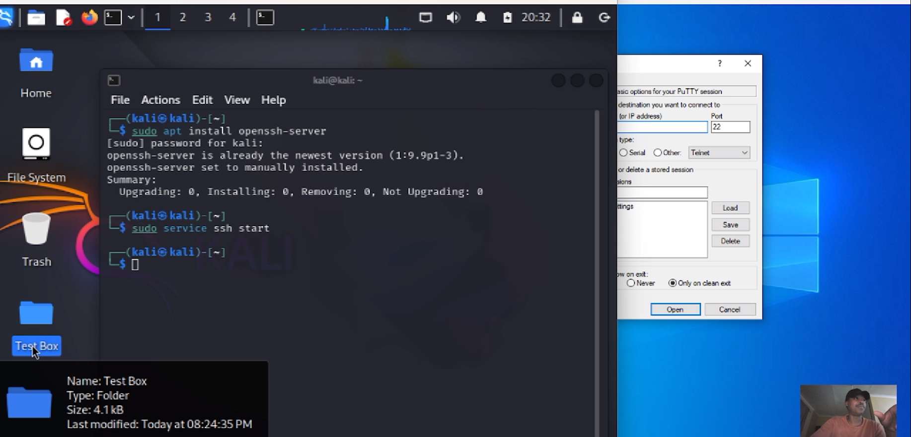
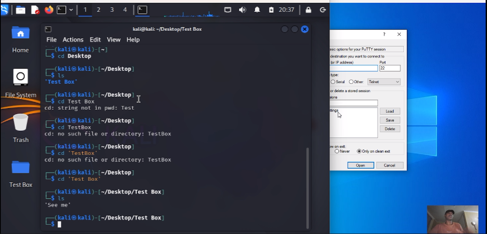
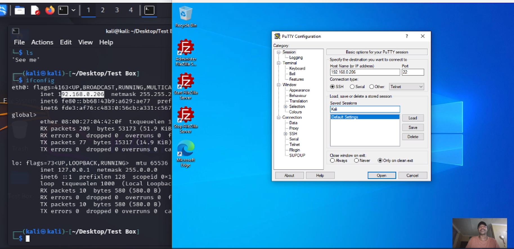
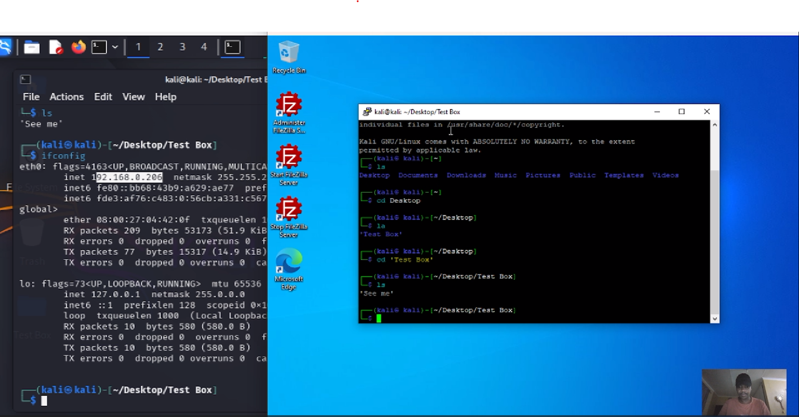

# Kali-SSH-Login-Demo
This lab demonstrates how to establish secure remote access to a Kali Linux machine from a Windows 10 client using SSH (Secure Shell). It’s part of my broader networking and cybersecurity learning series aimed at understanding secure communication protocols and remote administration.

## 🛠️ What I Did

🔹 Installed and configured `OpenSSH Server` on Kali Linux  
🔹 Created a test folder and file on the Kali desktop for demo purposes  
🔹 Used **PuTTY** on Windows 10 to establish a secure SSH session  
🔹 Navigated the Kali filesystem from the client to verify access

---

## 📸 Screenshots

| Step | Description                      | Screenshot                                         |
|------|----------------------------------|----------------------------------------------------|
| 1    | Kali Linux SSH Server Setup      |  |
| 2    | Created Folder and File in Kali  |        |
| 3    | Windows Client Using PuTTY       |        |
| 4    | SSH Login Successful             |       |

---

## 📺 Demo Video

Watch the full video walkthrough of this lab on YouTube (unlisted):  
🔗 [Watch the video here - SSH+PuttY_1](https://youtu.be/d2KBONbv894)
🔗 [Watch the video here - SSH+PuttY_2](https://youtu.be/hupRQGyow5E)

---

## 📂 Project Files

All screenshots, notes, and walkthroughs are included in this repository under the `Images/` folder. This lab complements my [FTP + Wireshark demo](https://lnkd.in/dnjWZdYK), which demonstrated the risks of insecure communication.

---

## 💡 Key Takeaway

Secure protocols like SSH are essential for remote administration. This lab highlights the simplicity and power of SSH—and why it’s a far better option than legacy protocols like Telnet or FTP.

---

## 📬 Coming Soon

🔥 The **FTP + Wireshark sniffing lab** was just the beginning. This SSH lab builds on that concept—next up, I’ll be diving into **Azure Labs** to explore real-world cloud infrastructure setups and security practices.

---

### #CyberSecurity #SSH #Linux #PuTTY #Networking #EthicalHacking #LearningInPublic #TechProjects
